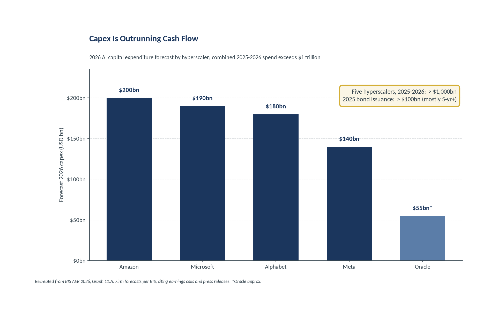
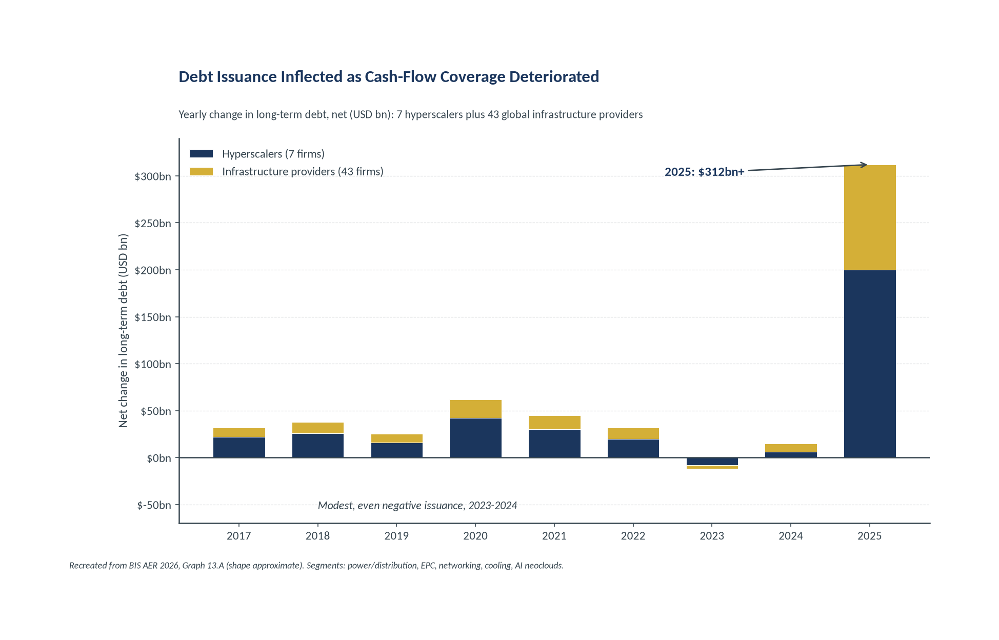
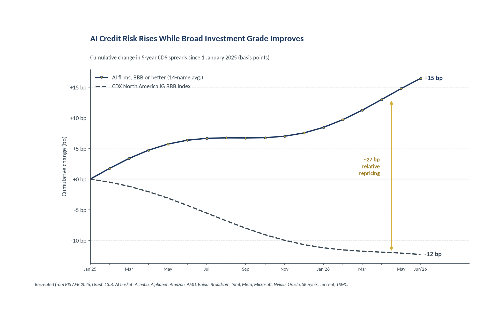
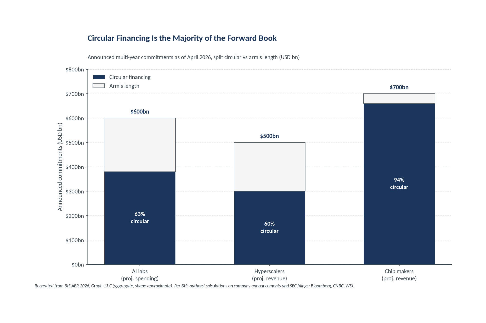
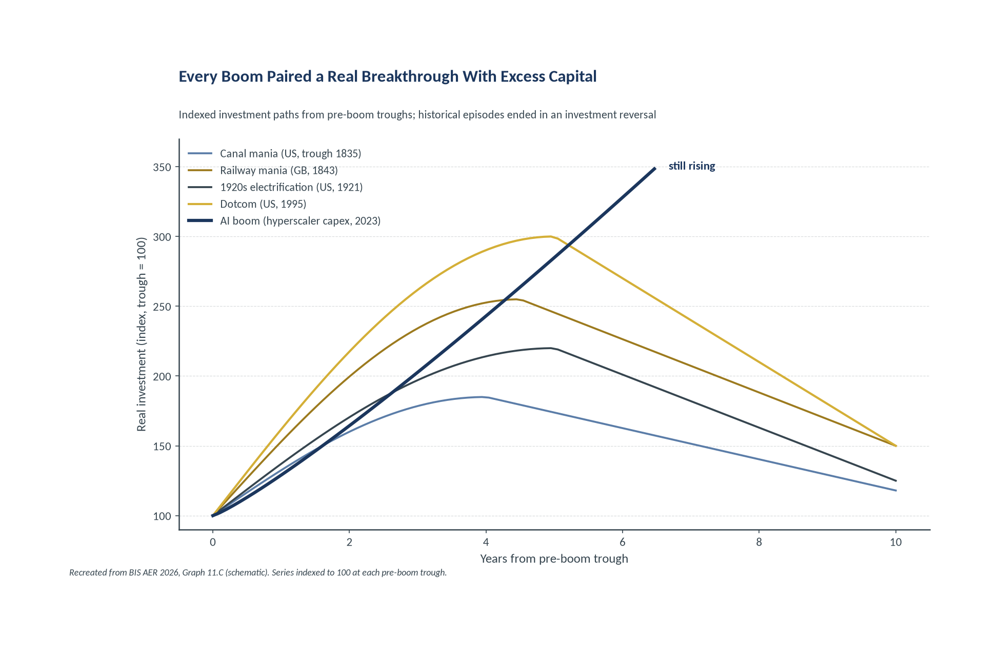
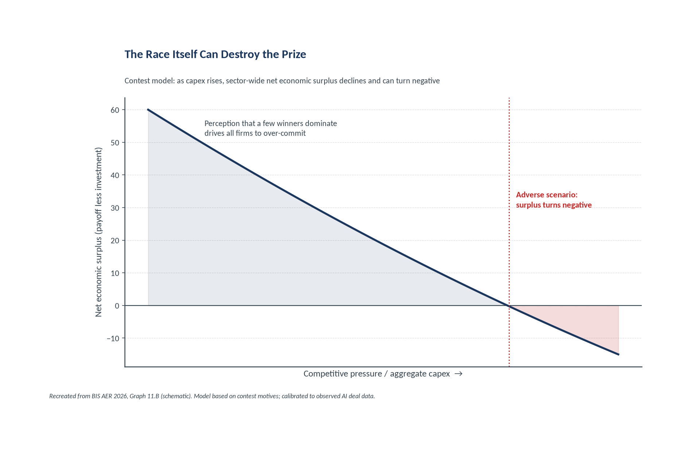
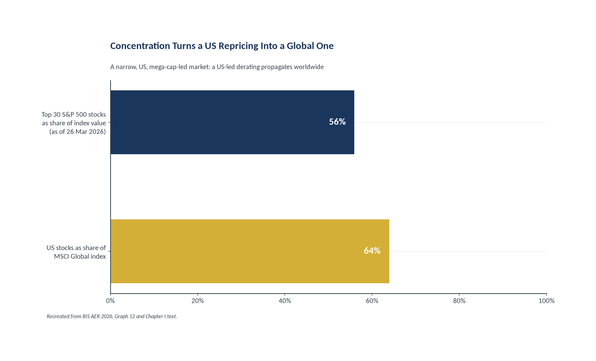
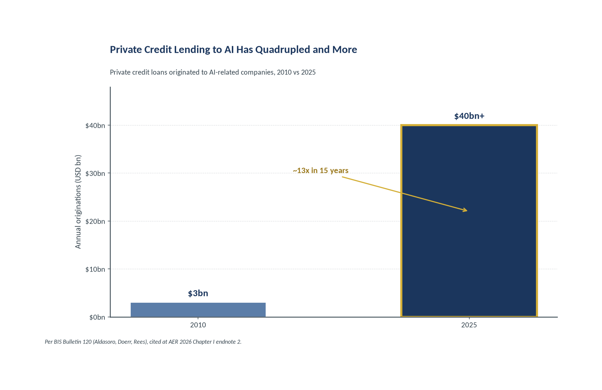

# Circular Money: The BIS on AI Financing Fragility

_Evidence from the BIS Annual Economic Report 2026, Chapter I: Progress and Peril (28 June 2026). Milhem Group Properties._

Slides: 30. Recreated BIS charts are referenced by filename under `source/charts/`.

---

## Title slide

**Circular Money: The BIS on AI Financing Fragility**

Evidence from the BIS Annual Economic Report 2026, Chapter I: Progress and Peril (28 June 2026)

Prepared for internal research use Milhem Group Properties | 22 July 2026 Primary source: BIS AER 2026, Chapter I | Companion: BIS Bulletin No. 120

---

## Slide 1: The Central Bank for Central Banks Just Mapped the Next Credit Cycle
_Section 1 · The Debt-Financed Capex Boom_

- The Annual Economic Report is the BIS flagship publication; the 2026 edition names **four pressure points**.
- This deck isolates the two we can act on: **AI investment sustainability** and **financial vulnerabilities**.
- The BIS warning is unusually specific for a flagship report:
- *"Disappointment in returns could trigger a sudden pullback in financing and turn the capex boom into a protracted investment bust, with potential knock-on effects on financial conditions."*

- **Persistent inflation risk** (PRESSURE POINT 1): Compute demand pressures electricity prices; tariff and supply effects keep inflation sticky.
- **Sustainability of AI investment** [COVERED] (PRESSURE POINT 2): A debt-financed, circular capex boom that is outrunning earnings and free cash flow.
- **Growing financial vulnerabilities** [COVERED] (PRESSURE POINT 3): Credit repricing, opaque private structures, private credit concentration, stretched valuations.
- **Weakening fiscal positions** (PRESSURE POINT 4): High public debt interacts with the shift of credit and leverage outside the banking system.

**Speaker notes:** When the institution that coordinates the world's central banks devotes its flagship report to a single corporate financing structure, the choice of subject is itself a signal. The AER is not a trading note; it is the official-sector base rate for how supervisors will frame the next cycle. Two of the four pressure points, AI investment sustainability and financial vulnerabilities, are the subject of this deck. The verbatim warning matters: the BIS is not forecasting a bust, it is documenting that a pullback in financing would convert a capex boom into an investment bust with system-wide knock-on effects. Read the quote as a supervisory hypothesis that the rest of Chapter I then evidences chart by chart.

_Source: BIS Annual Economic Report 2026, Chapter I 'Progress and peril' (28 June 2026), framing and Graph 11 section._

---

## Slide 2: Executive Summary: Five Findings
_Section 1 · The Debt-Financed Capex Boom_

| # | Finding | Supporting stat |
|---|---|---|
| 1 | **Scale.** Five hyperscalers to spend over $1 trillion on AI capex in 2025-2026, outpacing earnings and free cash flow. | > $1,000bn (Graph 11.A) |
| 2 | **Debt shift.** AI investment is increasingly debt-financed; net long-term debt across 7 hyperscalers plus 43 infrastructure providers spiked in 2025. | ~$300bn+ (Graph 13.A) |
| 3 | **Credit divergence.** 5-year CDS on BBB-or-better AI firms widened while the broad IG index tightened. | +15bp vs -12bp (Graph 13.B) |
| 4 | **Circularity.** Circular financing is the majority of both projected spending and projected forward revenue across the ecosystem. | Majority of forward book (Graph 13.C) |
| 5 | **Amplifiers.** Opaque private structures, private credit concentration and elevated equity valuations create transmission channels. | AI/IT ~15% of direct lending (Graphs 12, 14) |

> The through-line: **credit risk has moved off balance sheets and away from market pricing**, exactly where supervisors have least visibility.

**Speaker notes:** Frame the five findings as one chain, not five facts. Scale creates a funding gap; the gap is filled with debt; the debt sits inside reciprocal, circular commitments; those commitments are held together by poorly disclosed private structures; and the whole apparatus is amplified by private credit concentration and rich equity valuations. Each number in the right column is drawn directly from a numbered BIS graph, so the summary is an index to the evidence that follows. The single most important idea for positioning is the callout: risk has migrated to where it is least priced and least seen, which is precisely why the CDS market and the financing run-rate are the two leading indicators to watch.

_Source: BIS Annual Economic Report 2026, Chapter I 'Progress and peril' (28 June 2026), Graphs 11.A, 12, 13.A-C, 14._

---

## Agenda: How this briefing is organised

1. The Debt-Financed Capex Boom
2. Graph 13 Deep Dive: The Credit Market Evidence
3. Circular Financing Mechanics and Opacity
4. Historical Parallels and the Contest Model
5. Equity Valuations and Private Credit Amplifiers
6. Policy Response and Synthesis
7. Appendix

---

## Slide 3: Capex Is Outrunning Cash Flow
_Section 1 · The Debt-Financed Capex Boom_

- Five largest US hyperscalers (Alphabet, Amazon, Meta, Microsoft, Oracle) to spend **over $1 trillion** on AI capex across 2025-2026.
- 2026 forecasts, per BIS citing earnings calls: **Amazon $200bn, Microsoft $190bn, Alphabet ~$180bn, Meta ~$140bn**.
- Commitments **exceed earnings and free cash flow**; some firms issuing debt to bridge the gap.
- 2025 corporate bond issuance topped **$100bn**, predominantly maturities beyond five years.

**Speaker notes:** This slide marks a regime change. From roughly 2015 to 2023 the hyperscalers self-funded their build-out from operating cash flow; capex sat comfortably below internally generated cash. In 2025-2026 that reverses: capex commitments now exceed both earnings and free cash flow, and the gap is being closed with debt. That is exactly the shift BIS Bulletin 120 captured in its title, 'from cash flows to debt.' The per-firm 2026 figures are not estimates the BIS invented; they are drawn from the companies' own earnings calls and press releases. The $100bn-plus of 2025 bond issuance, mostly long-dated, is the financing counterpart of the capex line, and it is why the credit market, not just the equity market, now has a direct stake in AI returns.

_Source: BIS Annual Economic Report 2026, Chapter I 'Progress and peril' (28 June 2026), Graph 11.A. Firm forecasts per BIS, citing earnings calls and press releases._

---

## Slide 4: The Borrowing Ecosystem Extends Well Beyond the Hyperscalers
_Section 1 · The Debt-Financed Capex Boom_

| Segment (Graph 13.A universe) | What they finance | Balance-sheet fragility |
|---|---|---|
| Hyperscalers (7 firms) | Balance-sheet capex and bond issuance | Strong, but coverage now deteriorating |
| Power and distribution | Grid, substations, on-site generation | Capital intensive, long lead times |
| Engineering and construction (EPC) | Data centre build-out contractors | Comparatively weak balance sheets |
| Networking | Interconnect and switching gear | Cyclical, order-book dependent |
| Cooling systems | Liquid and air thermal management | Concentrated, capacity-constrained |
| AI neoclouds | GPU-as-a-service providers | Thin equity, highly leveraged |

> BIS singles out **EPC contractors**: comparatively weak balance sheets, directly exposed to any hyperscaler capex pullback.

**Speaker notes:** The Graph 13.A universe is deliberately wide: seven hyperscalers plus forty-three global infrastructure providers across five segments. The point is that the credit exposure is not concentrated in five fortress balance sheets; it runs down a supply chain whose weakest links are the engineering and construction contractors and the neoclouds. Rank the segments by balance-sheet fragility and you get a rough order of which credits crack first in a pullback: EPC contractors and thinly capitalised neoclouds ahead of the hyperscalers themselves. This is the transmission map. When the BIS warns that a financing pullback turns a boom into a bust, the mechanism is that these supply-chain borrowers cannot replace lost hyperscaler revenue or service the debt they took on to build capacity.

_Source: BIS Annual Economic Report 2026, Chapter I 'Progress and peril' (28 June 2026), Graph 13.A methodology (7 hyperscalers plus 43 global infrastructure providers, five segments)._

---

## Slide 5: Debt Issuance Inflected Exactly as Coverage Deteriorated
_Section 1 · The Debt-Financed Capex Boom_

**Speaker notes:** Read the shape, not just the level. For most of 2017-2022 net long-term debt issuance across the AI supply chain was modest and steady. In 2023-2024 it was flat to negative, consistent with the self-funded era. Then 2025 breaks the pattern with a spike to roughly three hundred billion dollars and more, split between the hyperscalers and their infrastructure suppliers. The timing is the tell: issuance inflected in the same year free cash flow coverage of capex deteriorated. That is the empirical core of the 'from cash flows to debt' thesis. The methodology footnote matters for the audit trail: this is net change in long-term debt, drawn from global financial statements for the fifty-firm universe, so it captures the supply chain and not only the marquee names.

_Source: BIS Annual Economic Report 2026, Chapter I 'Progress and peril' (28 June 2026), Graph 13.A. Recreation, shape approximate; 2025 total roughly $300bn-plus._

---

## Slide 6: Bottlenecks Amplify Overcommitment
_Section 1 · The Debt-Financed Capex Boom_

- BIS flags **electricity, advanced semiconductor and grid-equipment bottlenecks** as binding constraints on the build-out.
- Firms lock in future capacity through **long-dated contracts**, further exposing themselves to demand disappointment.
- Computing demand is already **pressuring electricity prices**, with inflation-spillover potential (pressure point 1).
- Contracted capacity converts fixed commitments into **operating leverage**: fixed costs that do not fall if demand does.

> Long-dated capacity contracts are the operating-leverage mirror of long-dated debt: both raise the cost of being wrong about demand.

**Speaker notes:** Bottlenecks look like a bullish scarcity story until you invert them. To secure scarce power, chips and cooling, firms sign long-dated contracts for future capacity. Those contracts are fixed commitments: if AI demand disappoints, the capacity still has to be paid for. That is operating leverage layered on top of financial leverage. The same compute demand that strains the grid also feeds pressure point one, inflation, by pushing up electricity prices. So the bottleneck is not a moat; it is a second channel through which disappointment becomes expensive. In a downturn, a firm carrying both long-dated debt and long-dated capacity contracts has very little flexibility, which is exactly the condition that turns a slowdown into a forced deleveraging.

_Source: BIS Annual Economic Report 2026, Chapter I 'Progress and peril' (28 June 2026), Graph 11 section and pressure-point 1 discussion._

---

## Slide 7: Graph 13: Corporate Credit Is Vulnerable to Repricing on AI Disappointments
_Section 2 · Graph 13 Deep Dive: The Credit Market Evidence_

***Panel A.** Investment is increasingly debt-financed; net issuance spiked in 2025.*

***Panel B.** AI credit risk rises while broad investment grade improves.*

***Panel C.** Circular financing is the majority of the forward book.*

> This is the single most-cited exhibit from the report in market commentary. The three panels are one argument: more debt (A), already repricing (B), inside circular structures (C).

**Speaker notes:** Graph 13 is the spine of the chapter and the exhibit the market seized on. Treat it as a single three-part sentence rather than three charts. Panel A establishes that the build-out is increasingly funded by debt. Panel B shows the credit market has already begun to reprice that debt for AI-specific risk, even as broad investment grade improves. Panel C explains why the risk is hard to see: the majority of the forward book is circular, reciprocal financing rather than arm's length demand. The following three slides take each panel in turn. The reason to lead with the triptych is that any one panel invites a rebuttal; together they are much harder to dismiss, which is why supervisors and strategists cite the composite.

_Source: BIS Annual Economic Report 2026, Chapter I 'Progress and peril' (28 June 2026), Graph 13 (Panels A, B, C)._

---

## Slide 8: Panel B: The CDS Divergence
_Section 2 · Graph 13 Deep Dive: The Credit Market Evidence_

- Cumulative change in 5-year CDS since 1 Jan 2025: AI basket **up ~15bp**, CDX NA IG BBB **down ~12bp**.
- A roughly **27bp relative repricing** of investment-grade AI credit versus the broad index.
- The basket is 14 BBB-or-better AI names:
- *Alibaba, Alphabet, Amazon, AMD, Baidu, Broadcom, Intel, Meta, Microsoft, Nvidia, Oracle, SK Hynix, Tencent, TSMC*
- The CDS market is repricing AI credit while **equities still price significant upside**.

**Speaker notes:** Panel B is the cleanest evidence of a two-market disconnect. Since the start of 2025 the cost of default protection on a basket of fourteen investment-grade AI names has risen about fifteen basis points, while the same protection on the broad investment-grade index has fallen about twelve. That twenty-seven basis point relative move is small in absolute terms but directional and persistent, and it is happening in names rated BBB or better, not in speculative credits. The significance is that the credit market and the equity market are telling opposite stories about the same companies: bonds are pricing rising risk while equities still price substantial upside. When two markets on the same names diverge, the BIS reading is that one of them is wrong, and historically the credit market tends to move first.

_Source: BIS Annual Economic Report 2026, Chapter I 'Progress and peril' (28 June 2026), Graph 13.B. Basket: simple average of AI firms rated BBB or better._

---

## Slide 9: Panel C: Circular vs Arm's Length
_Section 2 · Graph 13 Deep Dive: The Credit Market Evidence_

- Circular financing is the **majority** of both projected spending and projected revenue across the ecosystem.
- Chip makers' projected revenue commitments are **almost entirely circular**.
- Methodology: **announced multi-year commitments as of April 2026**.
- Per BIS: authors' calculations on company announcements and SEC filings, plus Bloomberg, CNBC and The Wall Street Journal.

**Speaker notes:** The critical distinction on this slide is trailing versus forward. When AI vendors rebut circularity concerns they point to booked, trailing revenue, most of which is genuinely arm's length. The BIS chart measures something different: the announced, multi-year forward book as of April 2026. On that forward book, circular commitments are the majority of both the spending side and the revenue side, and for chip makers the forward revenue is almost entirely circular. That is the number that matters for valuation, because equity prices capitalise the forward book, not last year's sales. Keep the methodology in view: this is an aggregate built from public announcements and filings, not a set of per-company deal values, so the honest claim is about the shape of the forward book, not any single transaction.

_Source: BIS Annual Economic Report 2026, Chapter I 'Progress and peril' (28 June 2026), Graph 13.C. Per BIS, citing Bloomberg, CNBC, LSEG Datastream, S&P Global Market Intelligence, The Wall Street Journal._

---

## Slide 10: Why Equity Repricing Becomes Credit Repricing
_Section 2 · Graph 13 Deep Dive: The Credit Market Evidence_

**BIS footnote mechanic: a fall in firm valuation compresses the net-worth buffer over liabilities, which raises default probabilities and widens spreads.**

**Flow:** AI disappointment -> Equity derating -> Net-worth compression -> Spread widening -> Credit freeze -> Capex bust feedback

- Broad credit-spread indices correlate **negatively** with stock returns, more so in high yield.
- Synchronized equity-credit corrections are rare but precedented: the GFC and the March 2020 dash for cash.
- A repricing could be **similarly disruptive**, triggering a corporate credit freeze with wider implications for aggregate investment.

**Speaker notes:** This is the mechanism that connects the equity market to the credit market, and it is why the two-market disconnect on the previous slide is dangerous rather than merely interesting. A firm's ability to service debt rests on the buffer between its asset value and its liabilities. When AI disappointment derates equity, that buffer compresses, modelled default probabilities rise, and spreads widen even without any change in cash flow yet. Spreads and stock returns are negatively correlated, more strongly in high yield, so an equity shock transmits into credit. Simultaneous equity-credit corrections are rare, but the GFC and March 2020 show they happen and are severe. The tail the BIS is pointing at is a corporate credit freeze that feeds back into capex, turning a valuation event into an investment-and-growth event.

_Source: BIS Annual Economic Report 2026, Chapter I 'Progress and peril' (28 June 2026), footnote 1 and Graph 14.A context._

---

## Slide 11: What the BIS Means by Circular Financing
_Section 3 · Circular Financing Mechanics and Opacity_

**Chip makers and hyperscalers take equity stakes in AI labs or neocloud providers, who in turn commit to multi-year purchases of chips or computing power, rechannelling capital back to the investors as revenue.**

**Flow:** Chip maker / Hyperscaler --(equity stake)--> AI lab / Neocloud --(purchase commitment)--> Revenue back to investor

> **Arm's length financing**, by contrast, is capital that flows without such reciprocity: a lender or customer with no equity stake in its counterparty.

**Speaker notes:** Define the term precisely because the whole debate turns on it. Circular financing is not fraud and not necessarily improper; every step is typically legal and disclosed. It is a structure in which the investor and the customer are the same party wearing two hats. A chip maker or hyperscaler takes an equity stake in an AI lab or neocloud; that counterparty then commits to multi-year purchases of chips or compute; and the cash the investor put in returns as recognised revenue. The concern is not any single loop but the aggregate: when this is the majority of the forward book, reported revenue growth is partly a function of the vendor's own capital rather than independent end demand. Arm's length financing, the contrast case, has no such reciprocity, which is why the split on Graph 13.C is the number that matters.

_Source: BIS Annual Economic Report 2026, Chapter I 'Progress and peril' (28 June 2026), circular financing definition._

---

## Slide 12: The Second Circle: Data Centre Lease-Backs
_Section 3 · Circular Financing Mechanics and Opacity_

- Data centre construction is increasingly **outsourced to third parties** that build and own the facilities.
- Those owners **lease the facilities back** to hyperscalers on long-dated contracts.
- Contracts frequently carry **embedded exit clauses**; terms are typically poorly disclosed.
- An exit clause converts apparently contracted revenue into **optionality** held against the weakest counterparties.

> What looks like a locked, long-dated lease is only as firm as the exit clause buried in it, and those clauses sit with the tenants most able to walk.

**Speaker notes:** The lease-back is the second circle layered on top of the equity-for-commitment first circle. Rather than build and own data centres, hyperscalers increasingly have third parties construct them and then lease them back on long-dated terms. On the surface that produces stable, contracted revenue for the facility owner and off-balance -sheet capacity for the tenant. The problem is the embedded exit clause. A long lease with an exit option is not a bond; it is a bond the tenant can hand back. Because the terms are poorly disclosed, an outside analyst cannot tell how much of the owner's contracted revenue is genuinely firm. The optionality is held by the strongest party, the hyperscaler, against the weakest, the leveraged facility owner, so in a downturn the losses concentrate exactly where the balance sheets are thinnest.

_Source: BIS Annual Economic Report 2026, Chapter I 'Progress and peril' (28 June 2026), data centre lease-back discussion._

---

## Slide 13: Poor Disclosure, Pledged Twice
_Section 3 · Circular Financing Mechanics and Opacity_

- Deal terms are **typically poorly disclosed** across these private arrangements.
- There is a risk of the **same asset being pledged multiple times** (rehypothecation).
- Together, these arrangements account for a **sizeable share** of sector-wide financing and forward revenue.
- Structural consequence: credit risk migrates **off issuer balance sheets and away from market pricing**.

> **You cannot model what is not disclosed.** The disclosure that matters no longer sits in the financial statements investors use to value these firms.

**Speaker notes:** This slide states the structural punchline. Two features compound each other: terms are poorly disclosed, and the same collateral can be pledged more than once. Individually each is a familiar market imperfection. Together they mean that a meaningful share of the sector's financing and forward revenue sits in arrangements an outside analyst cannot see or verify. The consequence is not just opacity for its own sake; it is that credit risk has been deliberately migrated off the issuers' balance sheets and away from observable market prices. So the documents investors actually use, the 10-K and the 10-Q, no longer contain the exposures that matter most. That is why the gold callout is blunt: valuation models built on disclosed financials are modelling the wrong balance sheet, and the risk they miss is precisely the risk the BIS is flagging.

_Source: BIS Annual Economic Report 2026, Chapter I 'Progress and peril' (28 June 2026), disclosure and collateral discussion._

---

## Slide 14: Opacity Compounds Every Other Vulnerability
_Section 3 · Circular Financing Mechanics and Opacity_

**The private arrangement types**

- Equity-for-commitment (circular financing)
- Data centre lease-backs with exit clauses
- Private credit loans held at mark-to-model

**The specific opacity in each**

- Revenue reciprocity not visible in end-demand data
- Exit optionality and terms not disclosed
- No observable price until stress forces one

> BIS: interlinkages have deepened and could become **powerful amplifiers at times of stress**. Authorities cannot respond to risks they cannot see.

**Speaker notes:** Pull the section together. Hyperscalers, chip makers and AI labs are linked through a complex web of private arrangements, and those interconnections have deepened over the cycle. In calm markets the web looks like efficient risk-sharing. In stress it becomes an amplifier, because a problem at one node propagates through commitments, leases and loans that outsiders cannot map. The BIS makes the supervisory point explicitly: data gaps are themselves a vulnerability, because authorities cannot respond to risks they cannot see. The two-column layout is the takeaway to remember: for each private structure there is a specific piece of information that is missing, and it is always the piece that would tell you how bad things could get. That is what makes opacity a multiplier on every other vulnerability in the deck rather than a separate item.

_Source: BIS Annual Economic Report 2026, Chapter I 'Progress and peril' (28 June 2026), interconnections and data-gaps discussion._

---

## Slide 15: Every Boom Paired a Real Breakthrough With Excess Capital
_Section 4 · Historical Parallels and the Contest Model_

- Episodes: canal mania (US, trough 1835), railway mania (GB, 1843), 1920s electrification (US, 1921), dotcom (US, 1995), AI (2023).
- Each paired a **genuine technological breakthrough** with capital in excess of what commercial returns could justify.
- Each ended with an **investment reversal that induced an economy-wide recession**.
- A flagship report choosing this comparison is itself a form of official-sector position-taking.

**Speaker notes:** The historical panel is doing rhetorical work as well as analytical work. Analytically, it makes one claim: every one of these episodes combined a real, durable technological breakthrough with a wave of capital that exceeded what commercial returns could ultimately justify, and each ended in an investment reversal that pulled the wider economy into recession. Canals, railways, electrification and the internet were all genuinely transformative, and all of them still over-built. Rhetorically, the fact that the BIS chose to put this comparison in a flagship report is a statement. Central banks are cautious about calling bubbles; embedding the AI boom in a lineage of over-investment episodes is about as close as the official sector comes to taking a position. The base rate it implies is not neutral: these episodes ended in reversals, not soft landings.

_Source: BIS Annual Economic Report 2026, Chapter I 'Progress and peril' (28 June 2026), Graph 11.C. Series indexed to 100 at each pre-boom trough._

---

## Slide 16: The Race Itself Can Destroy the Prize
_Section 4 · Historical Parallels and the Contest Model_

- Graph 11.B is a model based on **contest motives**.
- The perception that a few players with superior technology will dominate drives **all firms to over-commit**.
- As competitive pressure drives capex higher, sector **net economic surplus declines and can turn negative**.
- The modelled financial unwind involves **partial dissolution of partnerships and debt fire sales**.

**Speaker notes:** The contest model gives the over-investment a rational micro-foundation, which makes it more worrying, not less. If everyone believes a small number of winners will capture the market, then each firm's best response is to spend aggressively to be among them. The result is a classic contest: individually rational bidding that is collectively wasteful. As aggregate capex rises, the sector's net economic surplus, total payoff less investment cost, falls and can go negative in adverse scenarios. The important link to earlier sections is the modelled unwind. The BIS does not describe a gentle mean-reversion; it describes partial dissolution of partnerships and debt fire sales. Those partnerships are the very circular, equity-for-commitment structures from Section 4, so the model is effectively pricing the failure mode of the deals this deck has been mapping.

_Source: BIS Annual Economic Report 2026, Chapter I 'Progress and peril' (28 June 2026), Graph 11.B. Model calibrated to observed AI deal data and historical technology-boom evidence._

---

## Slide 17: The BIS Bust Sequence
_Section 4 · Historical Parallels and the Contest Model_

**Flow:** Returns disappoint -> Sudden financing pullback -> Capex boom becomes protracted investment bust -> Knock-on effects on financial conditions -> Supply-chain borrowers cannot replace revenue or service debt

- Link 1-2: the verbatim AER warning on financing pullback (Graph 11 section).
- Link 3: the investment-bust framing echoing the historical episodes (Graph 11.C).
- Link 4: equity-credit transmission and a possible credit freeze (Graph 14.A, footnote 1).
- Link 5: EPC and neocloud fragility, the weakest balance sheets in the chain (Graph 13.A).

**Speaker notes:** This is the whole thesis expressed as a causal chain, with each link anchored to a specific part of the report so it is not a narrative but a map. Returns disappoint; financing is pulled suddenly rather than tapered; the capex boom becomes a protracted investment bust; that bust feeds through to broader financial conditions; and the supply-chain borrowers, the EPC contractors and neoclouds, cannot replace the lost hyperscaler revenue or service the debt they raised to build capacity. Presenting it this way does two things. It shows the argument is internally consistent, each link follows from the last, and it shows the argument is sourced, each link points to the graph that evidences it. For an investor, the value is knowing which observable, the financing run-rate, sits at the second link, because that is the earliest place the chain becomes visible.

_Source: BIS Annual Economic Report 2026, Chapter I 'Progress and peril' (28 June 2026), Graph 11 and Graph 13-14 sections._

---

## Slide 18: Equity Valuations Price the Opposite of the CDS Market
_Section 5 · Equity Valuations and Private Credit Amplifiers_

- Implied long-term EPS growth for the largest corporations sits **well above** the median since Feb 2003, and often above what these firms delivered historically.
- Risk premia on the **30 largest S&P 500 stocks (56% of index value, 26 Mar 2026)** have compressed markedly post-pandemic.
- **Household equity exposure** is elevated relative to wealth and income.
- US stocks are **~64% of the MSCI Global index**, so a US-led repricing propagates worldwide.

**Speaker notes:** Graph 12 is the equity-side mirror of the CDS panel, and the two point in opposite directions on the same names. Implied long-term earnings growth for the biggest corporations is well above its historical median and often above what those firms actually delivered in their own histories, so the market is extrapolating exceptional outcomes. At the same time risk premia on the thirty largest stocks, which are fifty-six percent of the index, have compressed, meaning investors are accepting less compensation for risk just as the concentration rises. Two further facts widen the blast radius: households are unusually exposed to equities relative to wealth and income, and the US is about sixty-four percent of global equity market value. A US-led derating therefore does not stay domestic; it transmits globally with larger wealth-effect consequences than in past cycles.

_Source: BIS Annual Economic Report 2026, Chapter I 'Progress and peril' (28 June 2026), Graph 12._

---

## Slide 19: Private Credit: The Quadrupled AI Exposure
_Section 5 · Equity Valuations and Private Credit Amplifiers_

- Direct lending funds have **quadrupled** AI and IT lending over five years, to about **15% of portfolios**.
- These loans are **larger** than other sectors while tenor and pricing stay similar, raising lending-standard questions.
- Software firms draw on **multiple private credit lenders at once**, increasing concentration risk.
- Per Bulletin 120: private credit loans to AI companies grew from **~$3bn (2010) to over $40bn (2025)**.

**Speaker notes:** Private credit is the amplifier the BIS spends the most words on, because it combines concentration, weak disclosure and a growing retail footprint. Direct lending funds have quadrupled their AI and IT exposure in five years to roughly fifteen percent of portfolios. The underwriting question is sharp: these loans are larger than comparable loans to other sectors, yet their maturity and pricing look broadly similar, which implies either that the risk is being under-priced or that standards have loosened as volumes grew. Because software borrowers tap several private lenders simultaneously, a single troubled borrower can hit multiple funds at once. The two-point chart uses the narrower Bulletin 120 origination measure, three billion to over forty billion, to make the growth vivid; the fifteen percent portfolio figure is the AER's broader AI-and-IT bucket, reconciled in the companion deck.

_Source: BIS Annual Economic Report 2026, Chapter I 'Progress and peril' (28 June 2026), Graph 14 and endnote 2 (Aldasoro et al 2026, BIS Bulletin 120)._

---

## Slide 20: Redemptions, Bank Linkages, and the Retail Channel
_Section 5 · Equity Valuations and Private Credit Amplifiers_

- Direct lending funds catering to **retail investors** have faced mounting redemption requests.
- Some have been forced to **liquidate assets and return capital** despite no contractual obligation to do so.
- Banks carry **growing and opaque exposure** to private credit funds, compounded by insurance balance-sheet ties.
- The affected borrowers (smaller corporates) drive a large share of **job creation**, so real-economy effects could be substantial.

> Mark-to-model means **no observable price until stress forces one**. Redemption-driven liquidation is exactly that forcing event.

**Speaker notes:** This slide shows the stress is not hypothetical; some of it is already visible. Private credit funds that opened to retail investors are seeing redemption requests, and several have chosen to liquidate assets and return capital even though the fund structure did not obligate them to. That matters because the whole stabilising premise of private credit, covered on the next section's companion deck, is that closed-end structures lock capital and avoid forced sales. Retail redemptions erode that premise. Meanwhile banks and insurers have growing, opaque links to these funds, so a problem does not stay ring-fenced. And the ultimate borrowers are smaller corporates that punch above their weight in job creation, which is why the BIS treats this as a real-economy channel and not just a fund-liquidity issue. Mark-to-model hides the price until a redemption forces the sale.

_Source: BIS Annual Economic Report 2026, Chapter I 'Progress and peril' (28 June 2026), Graph 14 and private credit discussion._

---

## Slide 21: Credit and Leverage Have Left the Regulated Perimeter
_Section 5 · Equity Valuations and Private Credit Amplifiers_

- NBFIs are shifting **credit and leverage outside the banking sector** and interacting with fiscal risks.
- Frontier AI models **lower the cost and accelerate the pace** of cyber attacks on the financial system.
- The adequacy of the **current regulatory framework** is being tested by both shifts.
- This is the bridge from documented vulnerability to **policy response**.

**Speaker notes:** Keep this one short; it is a bridge into the policy section. The secular story underneath every amplifier in this deck is that credit intermediation and leverage have migrated out of the regulated banking perimeter into non-bank financial institutions. That migration interacts with the fiscal pressure point, because sovereigns and NBFIs are increasingly linked through holdings and guarantees. The BIS adds a distinct operational risk: frontier AI models lower the cost and raise the speed of cyber attacks, so the same technology driving the investment boom also stresses financial-system resilience. The common thread is that the existing regulatory framework was built for a bank-centric system and is now being tested by a non-bank one. That framing sets up the prescription: extend prudential standards to where the risk actually sits.

_Source: BIS Annual Economic Report 2026, Chapter I 'Progress and peril' (28 June 2026), NBFI and operational-risk discussion._

---

## Slide 22: What the BIS Wants Done
_Section 6 · Policy Response and Synthesis_

| Area | Prudential recommendation |
|---|---|
| Banking | Finalise and implement Basel III consistently; resist deregulation framed as simplification. |
| NBFIs | Extend rigorous prudential standards via entity-based and activity-based approaches. |
| Securities financing | Apply minimum haircuts on securities financing transactions. |
| Open-ended funds | Tighten liquidity management; broaden central clearing. |
| Data gaps | Close gaps on NBFI leverage, bank-NBFI interconnectedness and private credit exposures. |
| AI supervision | Improve visibility into AI use, model-driven correlated exposures, herding and algorithmic collusion. |

**Speaker notes:** The prescription follows directly from the diagnosis, so read each row against the vulnerability it addresses. Finalising Basel III and resisting deregulation-as-simplification protects the bank core. Extending prudential standards to NBFIs, through both entity-based and activity-based approaches, targets the migration of credit out of the regulated perimeter. Minimum haircuts on securities financing and tighter open-ended-fund liquidity rules attack the leverage and redemption channels that showed up in the private credit section. Closing data gaps is the direct answer to the opacity theme: authorities cannot respond to what they cannot see. And the AI-specific line, visibility into model-driven correlated exposures, herding and algorithmic collusion, acknowledges that the same technology can synchronise behaviour across firms. None of this is radical; it is mostly finishing post-2008 reforms and extending them to where the system actually moved.

_Source: BIS Annual Economic Report 2026, Chapter I 'Progress and peril' (28 June 2026), policy recommendations._

---

## Slide 23: What to Watch: A BIS-Derived Monitoring Checklist
_Section 6 · Policy Response and Synthesis_

| Indicator | Maps to | Priority |
|---|---|---|
| CDS basket vs CDX IG BBB differential | Graph 13.B | LEADING |
| Hyperscaler net long-term debt issuance run-rate | Graph 13.A | LEADING |
| Announced multi-year commitments and circular share | Graph 13.C | Monitor |
| EPC contractor credit spreads | Graph 13.A universe | Monitor |
| Private credit AI/IT portfolio share; retail fund redemptions | Graph 14 | Monitor |
| Direct lending fund liquidations | Graph 14 | Monitor |
| Hyperscaler 10-K lease and commitment footnote changes | Disclosure | Monitor |

> The two the BIS treats as **leading**: the CDS divergence and the financing pullback. Watch those first.

**Speaker notes:** Turn the report into an operating dashboard. Each row pairs a BIS vulnerability with an indicator you can actually observe, and the two gold rows are the ones the BIS itself treats as leading rather than coincident. The CDS differential between the AI basket and the broad index is the market's real-time verdict on AI credit; watch the direction and the pace, not the absolute level. The hyperscaler net-issuance run-rate is the financing-pullback tripwire: the thesis says the bust begins when financing is withdrawn, so a sharp deceleration in issuance is the earliest hard signal. The remaining rows are confirming indicators that tell you whether stress is spreading from prices into the plumbing. The disclosure row is slower but valuable, because a change in how hyperscalers footnote leases and commitments often precedes a change in the underlying risk.

_Source: BIS Annual Economic Report 2026, Chapter I 'Progress and peril' (28 June 2026), Graphs 13.A-C and 14._

---

## Slide 24: The Report in One Slide
_Section 6 · Policy Response and Synthesis_

**Flow:** Debt-financed capex $1T+ (11.A) -> Circular commitments, majority of forward book (13.C) -> Held by opaque private structures (rehypothecation) -> Already repricing in CDS (13.B)

**Flow:** Amplified: private credit ~15% of direct lending (14) -> Amplified: equities 64% of MSCI Global (12) -> Base rate: investment-bust recessions (11.C)

> The BIS is **not predicting a bust**. It is documenting that the system is now structured to **amplify one**.

**Speaker notes:** This is the deck compressed to a single causal picture, and the closing line is the one to leave in the room. Start at the top: a trillion-dollar debt-financed capex boom feeds a forward book that is majority circular; that book is held together by opaque private structures where the same asset can be pledged twice; and the credit market has already begun to reprice it. Then the amplifiers: private credit concentration and stretched, US-heavy equity valuations turn a sector problem into a system problem, while the historical base rate says episodes like this end in investment-bust recessions rather than soft landings. The crucial nuance is that none of this is a forecast. The BIS is making a structural claim, that the system is now wired to amplify a shock, and structural claims are more durable and more actionable than point predictions.

_Source: BIS Annual Economic Report 2026, Chapter I 'Progress and peril' (28 June 2026), Graphs 11.A, 11.C, 12, 13.B, 13.C, 14._

---

## Slide 25: Implications for Milhem Group Positioning
_Section 6 · Policy Response and Synthesis_  **[INTERNAL]**

**Question**

- What does the CDS-equity disconnect imply for index-level tail-hedge cost?
- How does private-credit opacity affect small-cap financing if a credit freeze materialises?
- How sensitive are microcap NCAV names to a broad credit tightening?
- Does the divergence justify avoiding AI-adjacent covered-call underwriting despite rich premiums?

**House view (interpretation, not BIS)**

- Tail hedges look comparatively cheap while equity vol lags credit; favour index puts over single-name.
- Assume small-cap refinancing windows narrow first; prefer names with no near-term maturities.
- NCAV names with clean balance sheets are more defensible; avoid those reliant on external financing.
- Lean away from AI-adjacent covered calls: premium does not compensate for gap risk into a repricing.

**Speaker notes:** This is the only interpretive slide and it is labelled INTERNAL for a reason: none of these views should be attributed to the BIS, which takes no investment position. Frame each item as a question first, then a one-line house view. The disconnect between calm equity volatility and a repricing credit market suggests index-level tail protection is relatively cheap right now, favouring broad puts over single-name hedges. If a credit freeze materialises, the financing window for small and micro caps narrows first, so balance-sheet quality and the absence of near-term maturities become the dominant screen, which actually supports clean-balance-sheet NCAV names over levered ones. On covered calls against AI-adjacent underlyings, the premiums are rich precisely because the market senses gap risk; underwriting that risk for modest yield is the trade the analysis argues against.

_Internal interpretation by Milhem Group. Not attributable to the BIS. For internal research use only._

---

## Slide 26: Appendix A: Graph Methodology (Audit Trail)
_Appendix_

| Graph | Universe | Sample | Data sources | Calculation |
|---|---|---|---|---|
| 11.A | 5 largest US hyperscalers | 2025-2026 | Earnings calls, press releases; BofA debt projections (per BIS) | Capex-to-revenue and gross debt issuance |
| 11.B | AI sector, modelled | Model | Contest-motive model, calibrated to AI deal data | Net economic surplus vs capex |
| 11.C | 5 historical episodes | From each trough | Historical national accounts and investment series | Indexed investment paths (trough = 100) |
| 13.A | 7 hyperscalers + 43 infra providers | 2017-2025 | Global financial statements | Net change in long-term debt |
| 13.B | 14 AI names, BBB or better | Since 1 Jan 2025 | CDS market data; CDX NA IG BBB | Cumulative 5-yr CDS change |
| 13.C | AI labs, hyperscalers, chip makers | As of Apr 2026 | Announcements, SEC filings; Bloomberg, CNBC, WSJ | Circular vs arm's length commitments |
| 14.B | Direct lending funds | 5-year window | Private credit data (Aldasoro et al 2026) | AI/IT portfolio share and terms |

**Speaker notes:** This is the audit trail for every chart in the deck, and it exists so that any number can be traced back to its BIS methodology note. Three things are worth flagging to a careful reader. First, the universes differ by graph: 11.A is the five largest US hyperscalers, 13.A widens to seven hyperscalers plus forty-three infrastructure providers, and 13.B is a fourteen-name credit basket, so the samples are not interchangeable. Second, several series rest on external inputs the BIS attributes explicitly, including Bank of America debt projections for 11.A and Bloomberg, CNBC and the Wall Street Journal for 13.C. Third, the historical and modelled panels, 11.B and 11.C, are exactly that, a model and an indexed reconstruction, not live market data, which is why the deck labels its recreations of them as schematic.

_Source: BIS Annual Economic Report 2026, Chapter I 'Progress and peril' (28 June 2026), Graphs 11.A-C, 13.A-C, 14.B methodology notes._

---

## Slide 27: Appendix B: Source Register
_Appendix_

- **BIS Annual Economic Report 2026, Chapter I**, 'Progress and peril' (28 June 2026). PDF: bis.org/publ/arpdf/ar2026e1.pdf
- **Graph data workbook**: bis.org/statistics/ar2026stats/ar2026e1_stats.xlsx
- **BIS press release p260628**: 'Global economic pressure points call for policy discipline'.
- **BIS Bulletin No. 120** (Aldasoro, Doerr, Rees), cited at Chapter I endnote 2.
- **BIS Working Paper 1343** (Rishabh and Shreeti), 'The geography of AI firms'; **Van Nieuwerburgh (2026)**, 'Financing the AI buildout', as cited by BIS.
- **Third-party inputs to Graph 13.C** (per BIS): Bloomberg, CNBC, LSEG Datastream, S&P Global Market Intelligence, The Wall Street Journal.

**Speaker notes:** The source register is the compliance backbone of the deck. Every factual claim on the content slides traces to one of these entries, and where the BIS itself relied on an outside input we carry that attribution through rather than presenting it as primary BIS data. The most important line is the last one: Graph 13.C, the circular-financing exhibit and the most-cited chart in the report, is built on company announcements and SEC filings supplemented by Bloomberg, CNBC, LSEG Datastream, S&P Global Market Intelligence and the Wall Street Journal. Being explicit about that protects the analysis from the charge that circularity is a third-party narrative; it is the BIS's own aggregation, with its inputs named. The Bulletin 120 entry is the bridge to the companion deck, which drills into the private credit plumbing the AER only summarises.

_Source: BIS Annual Economic Report 2026, Chapter I 'Progress and peril' (28 June 2026). Full citations; third-party inputs attributed as 'per BIS, citing [source]'._

---

## Slide 28: Appendix C: Glossary
_Appendix_

| Term | One-line definition |
|---|---|
| Circular financing | Investor takes an equity stake in a counterparty that then commits to buy from it; capital returns as revenue. |
| Arm's length financing | Capital that flows without reciprocity between investor and customer. |
| Rehypothecation | Re-pledging the same collateral to secure more than one obligation. |
| Neocloud | Specialised GPU-as-a-service provider renting AI compute, typically thinly capitalised. |
| EPC contractor | Engineering, procurement and construction firm that builds data centre capacity. |
| NBFI | Non-bank financial institution: funds, insurers and other credit providers outside the banking perimeter. |
| CDS spread | Annual cost of default protection on a bond; rises as perceived credit risk rises. |
| CDX NA IG BBB | A traded index of North American investment-grade CDS at the BBB tier. |
| Direct lending fund | Private credit vehicle that originates and holds loans to companies, often to maturity. |
| Mark-to-model | Valuing a position by model rather than observable market price. |
| Net economic surplus | Total payoff to a sector less its investment costs. |
| Hyperscaler | Large cloud and AI operator; BIS core set Alphabet, Amazon, Meta, Microsoft, Oracle (7-firm debt universe adds two). |

**Speaker notes:** The glossary exists so the deck can be read by someone outside the credit desk without losing precision. Two definitions carry most of the analytical weight and are worth stressing verbally. Circular financing is the structure in which the investor and the customer are the same party, so reported revenue partly reflects the vendor's own capital rather than independent demand. Rehypothecation is the practice of pledging the same asset more than once, which is how a given amount of collateral can support more credit than it appears to. Everything else, neoclouds, EPC contractors, NBFIs, mark-to-model, is vocabulary for the same underlying point the deck keeps returning to: credit risk in this cycle has been moved to entities and structures that are less regulated, less disclosed and less continuously priced than the bank-and-bond system it replaced.

_Source: BIS Annual Economic Report 2026, Chapter I 'Progress and peril' (28 June 2026), terminology per Chapter I._

---
