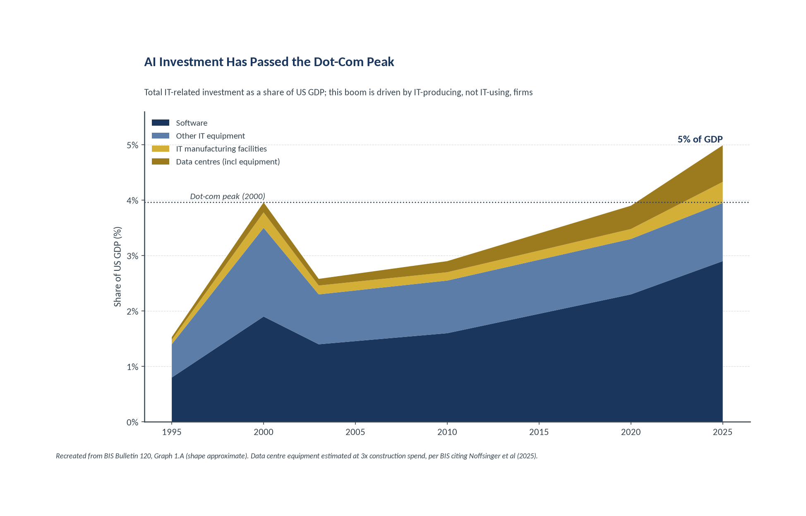
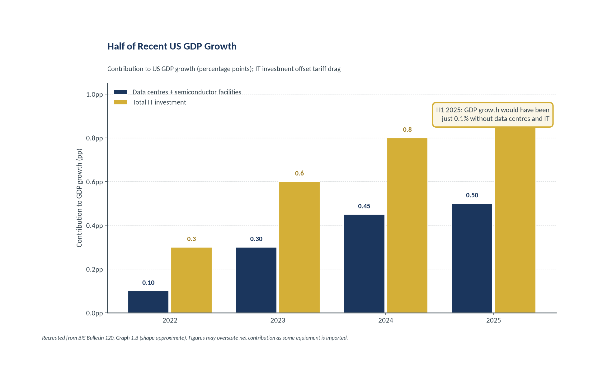
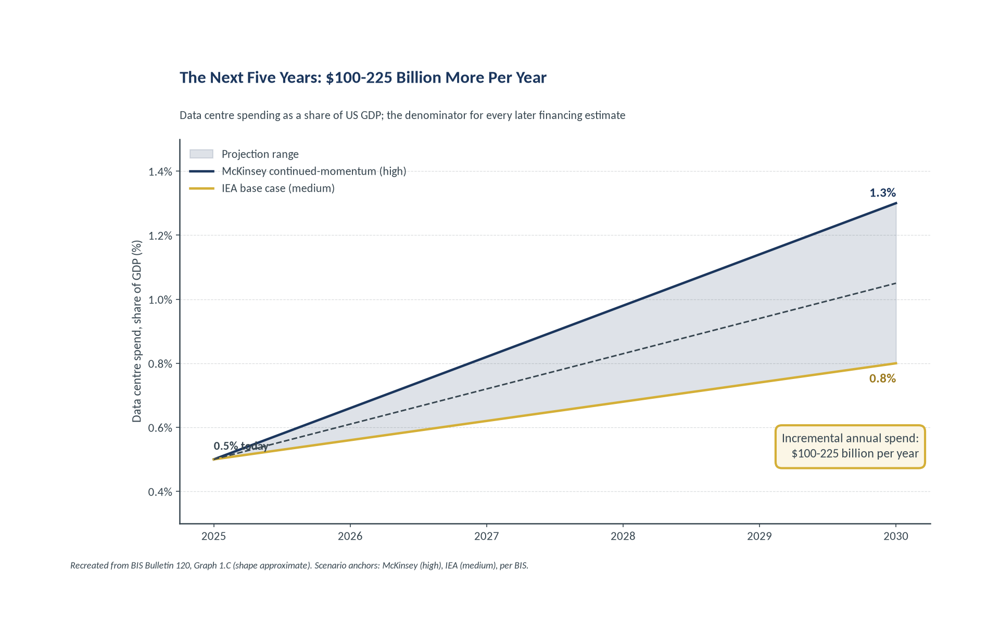
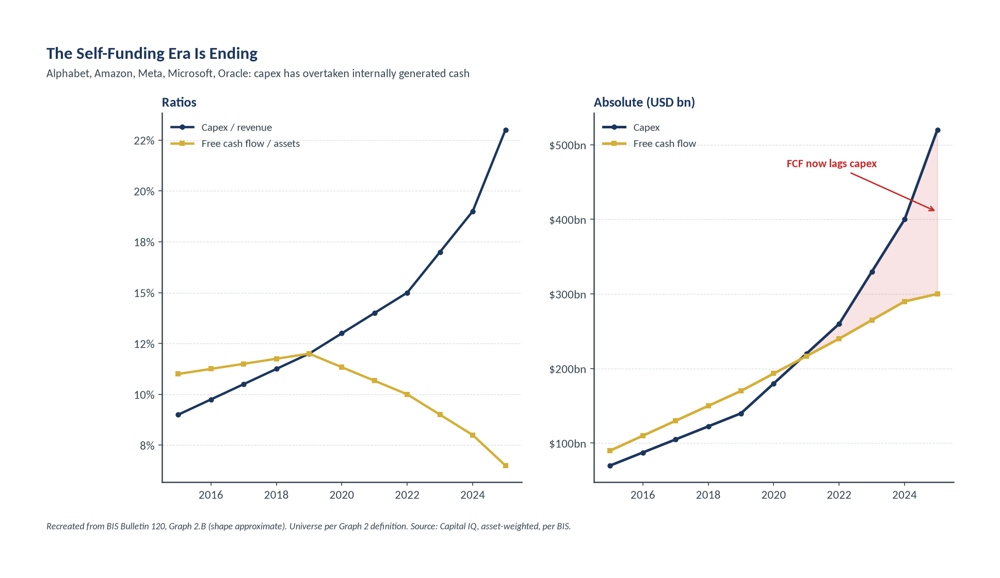
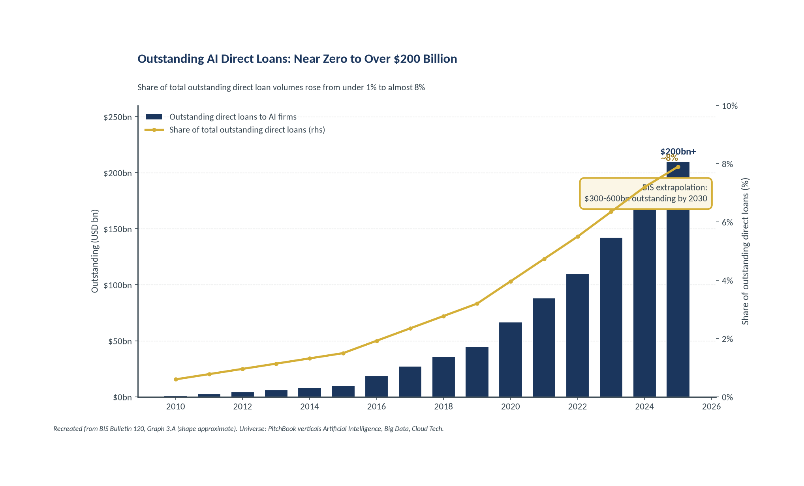
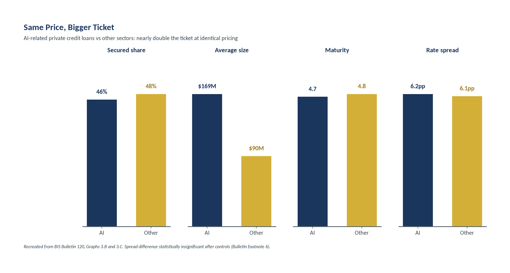
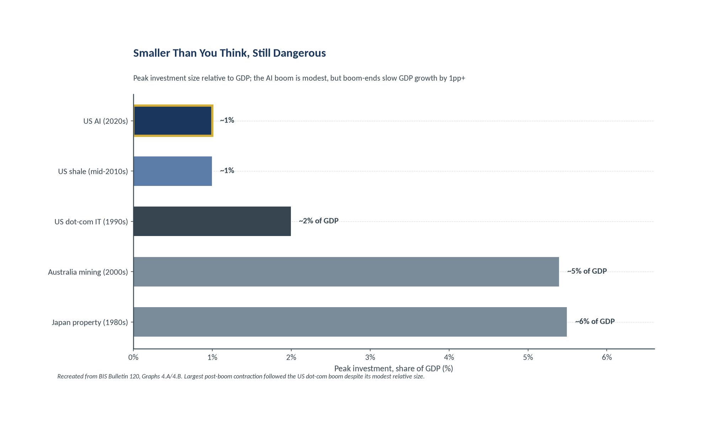

# From Cash Flows to Debt: Inside the AI Financing Shift

_A deep dive on BIS Bulletin No. 120 (Aldasoro, Doerr and Rees, 7 January 2026), companion to the AER 2026 Chapter I briefing. Milhem Group Properties._

Slides: 20. Recreated BIS charts are referenced by filename under `source/charts/`.

---

## Title slide

**From Cash Flows to Debt: Inside the AI Financing Shift**

A deep dive on BIS Bulletin No. 120 (Aldasoro, Doerr and Rees, 7 January 2026), companion to the AER 2026 Chapter I briefing

Prepared for internal research use Milhem Group Properties | 22 July 2026 Stage 2 of 2 | Channel-level evidence behind the system-level AER warnings

---

## Slide 1: Bulletin 120 in Three Sentences
_Section 1 · Macro Scale_

- **1. Scale.** AI-related investment is surging in nominal terms and as a share of GDP, and accounts for a substantial share of economic growth.
- **2. Financing shift.** Anticipated investment needs will force firms to move financing from operating cash flows to debt, with private credit playing a rapidly increasing role.

> **3. The pricing tension (the thesis of this deck).** Macro and financial-stability risks appear moderate, but sustainability hinges on AI firms meeting high earnings expectations, and equity prices have run far ahead of debt-market pricing.

**Speaker notes:** Lead with the three official takeaways in the Bulletin's own order, and note the tone. In January the BIS chose the words 'risks appear moderate.' That calibration matters, because six months later the flagship AER used sharper language about the same phenomena. The gap between the two documents is not a contradiction; it is the sound of new data moving an official assessment. The third takeaway is the one this deck is built around: even granting that aggregate risk looked moderate in January, the sustainability of the whole edifice rests on AI firms delivering exceptional earnings, and the equity market has already priced that outcome while the debt market has not. When two markets on the same names disagree that far, the disagreement itself is the signal, and the rest of the deck traces where it comes from.

_Source: BIS Bulletin No. 120 (Aldasoro, Doerr, Rees), 7 Jan 2026, key takeaways._

---

## Agenda: How this deep dive is organised

1. Macro Scale
2. The Financing Shift
3. Private Credit Channel
4. The Pricing Schism
5. Historical Perspective and Reconciliation
6. Appendix

---

## Slide 2: AI Investment Has Passed the Dot-Com Peak
_Section 2 · The Financing Shift_

- By mid-2025, IT manufacturing facilities plus data centres equalled **1% of US GDP**.
- Total IT-related investment (adding other IT equipment and software) reached **5% of GDP**, exceeding the 2000 dot-com peak.
- Unlike the dot-com episode, driven by IT-using firms, this boom is driven by **IT-producing firms**.
- Data centre equipment estimated at **3x construction spend**, per BIS citing Noffsinger et al (2025).

**Speaker notes:** Establish scale first, because everything downstream is a share of this number. Two figures anchor the slide. The narrow measure, IT manufacturing facilities plus data centres including their equipment, is about one percent of GDP as of mid-2025. The broad measure, adding other IT equipment and software, is five percent, which edges past the 2000 dot-com peak. The composition is the interesting part. The dot-com boom was driven by IT-using firms buying technology; this boom is driven by IT-producing firms building it, which changes who carries the balance-sheet risk. One methodology note to keep in view: the data centre equipment figure is estimated at three times construction spend, following the McKinsey rule of thumb that a new data centre is roughly one quarter structure and three quarters equipment.

_Source: BIS Bulletin No. 120 (Aldasoro, Doerr, Rees), 7 Jan 2026, Graph 1.A. Rule of thumb: structure one quarter, IT equipment three quarters of a new data centre._

---

## Slide 3: Half of Recent US GDP Growth
_Section 2 · The Financing Shift_

- From a negligible pre-2022 base, semiconductor-facility and data centre spending added an average **0.4pp** to GDP growth over three years.
- Total IT investment accounted for **almost half of GDP growth** in recent quarters, helping offset tariff drag.
- BIS caveat: figures may **overstate the net contribution** because some data centre equipment is imported.
- The macro economy is now partly **load-bearing** on this capex.

**Speaker notes:** This is why a pullback would be a growth event, not merely a sector event. From essentially nothing before 2022, spending on semiconductor facilities and data centres has added around four tenths of a percentage point to annual GDP growth, and once the full IT-investment complex is included it explains close to half of recent quarterly growth. In an economy also absorbing tariff drag, that contribution has been doing real work to keep headline growth positive. The BIS is careful to caveat that the gross figures probably overstate the net domestic contribution, because a share of the equipment is imported and therefore leaks abroad. Even net of that, the point stands: the macro economy has become partly load-bearing on AI capex, so if the financing that sustains that capex is withdrawn, the growth it has been providing goes with it.

_Source: BIS Bulletin No. 120 (Aldasoro, Doerr, Rees), 7 Jan 2026, Graph 1.B._

---

## Slide 4: The Next Five Years: $100-225 Billion More Per Year
_Section 2 · The Financing Shift_

- Analyst forecasts (per BIS) put incremental annual data centre spending at **$100-225 billion** over the next five years.
- Data centre spending rises from **0.5% of GDP today to between 0.8% and 1.3%**.
- Scenario anchors: the **McKinsey continued-momentum case (high)** and the **IEA base case (medium)**.

**Speaker notes:** The forward path sets the denominator for every financing estimate later in the deck, which is why it gets its own slide rather than a footnote. Analyst forecasts collected by the BIS imply an extra one hundred to two hundred and twenty-five billion dollars of data centre spending each year for the next five years, lifting data centre outlays from roughly half a percent of GDP today to somewhere between eight tenths and one and three tenths of a percent. The two scenario anchors bound the fan: the McKinsey continued-momentum case on the high side and the more conservative IEA base case in the middle. Whatever the exact path, the level roughly doubles as a share of GDP, and it is that projected spend, not today's, that firms are financing today. The gap between spend and internally generated cash is what forces the shift to debt.

_Source: BIS Bulletin No. 120 (Aldasoro, Doerr, Rees), 7 Jan 2026, Graph 1.C. Per BIS, citing McKinsey (Noffsinger et al 2025) and IEA (2025)._

---

## Slide 5: The Self-Funding Era Is Ending
_Section 3 · Private Credit Channel_

- These firms historically ran **much lower total debt to total assets** than other US non-financial firms.
- Capex has grown in absolute terms and as a **share of revenues**.
- Free cash flow has **recently lagged capital expenditure** in absolute amounts.
- This is the single chart that explains why debt issuance inflected in 2025 in the AER's Graph 13.A.

**Speaker notes:** This is the hinge chart of the whole two-deck project. The five firms, Alphabet, Amazon, Meta, Microsoft and Oracle, spent years as the market's cleanest balance sheets, carrying far less debt relative to assets than other large US non-financial companies. That is precisely what is now changing. The left panel shows capex rising as a share of revenue while free cash flow relative to assets drifts down; the right panel shows the same story in dollars, with capex overtaking free cash flow in absolute terms. Once internally generated cash no longer covers the build-out, the shortfall has to be funded externally, and for reasons the next slide explains that means debt. Read this chart and the AER's Graph 13.A debt spike stops being a surprise; it is the mechanical consequence of the lines crossing here.

_Source: BIS Bulletin No. 120 (Aldasoro, Doerr, Rees), 7 Jan 2026, Graph 2.B. Corporate finance universe (Graph 2): Alphabet, Amazon, Meta, Microsoft, Oracle._

---

## Slide 6: Why Debt and Not Equity
_Section 3 · Private Credit Channel_

**Why not equity**

- AI valuations are volatile and concentrated; issuance windows are narrow.
- New stock sales are costly and dilutive for long-dated, asset-heavy projects.
- Debt spreads costs over time and matches financing maturity to the long life of data centre assets.

**Why not only banks and bonds**

- Construction risk, power-availability risk and tenant concentration push financing beyond traditional scope.
- These risks sit awkwardly with standard bank and bond underwriting,
- notwithstanding reportedly record bond issuance.

**Speaker notes:** Answer the obvious question: if cash flow no longer covers capex, why not just issue equity. The Bulletin gives two clear reasons. First, AI equity valuations are volatile and concentrated and the windows to issue are narrow, so selling stock is costly and dilutive, and it is a poor match for long-dated, asset-heavy projects whose payoffs arrive over many years. Debt, by contrast, spreads the cost over time and lets firms match the maturity of the financing to the long economic life of a data centre. Second, even within debt, plain bank loans and public bonds do not fit neatly, because construction risk, uncertain power availability and tenant concentration sit awkwardly with standard underwriting. That gap between what the assets need and what banks and bond markets comfortably provide is the opening that private credit steps into, which is the next slide.

_Source: BIS Bulletin No. 120 (Aldasoro, Doerr, Rees), 7 Jan 2026, financing-choice discussion. Corporate finance universe (Graph 2): Alphabet, Amazon, Meta, Microsoft, Oracle._

---

## Slide 7: Why Private Credit Fits This Asset
_Section 3 · Private Credit Channel_

- Non-bank credit from **specialised funds**, directly negotiated and typically held to maturity.
- **Bespoke covenant structures**, greater certainty, faster execution and more flexible renegotiation.
- Mostly **closed-end funds** locking institutional capital for four to eight years, mitigating liquidity and maturity-transformation risk.
- Industry AUM grew from about **$100 billion in 2010 to over $2.2 trillion today**.

> The closed-end structure is the stabiliser. The AER's later observation of retail-facing funds facing redemptions is the **erosion of exactly that stabiliser**.

**Speaker notes:** Private credit fits this asset almost by design, and understanding why also tells you where it becomes fragile. It is non-bank credit from specialised funds, negotiated directly with the borrower and usually held to maturity, which allows bespoke covenants, greater certainty of funding, faster execution and more flexible renegotiation than a syndicated loan or a bond. Crucially, most of it sits in closed-end funds that lock institutional capital for four to eight years, which mitigates the liquidity and maturity-transformation risks that make banks vulnerable to runs. The industry has grown from about one hundred billion dollars in 2010 to over two point two trillion today. Hold on to the closed-end point, because the AER's later finding that retail-facing funds are meeting redemptions is precisely the erosion of the stabiliser that made private credit look safe here.

_Source: BIS Bulletin No. 120 (Aldasoro, Doerr, Rees), 7 Jan 2026, private credit characterisation. Per BIS, citing IMF (2024) and Avalos et al (2025)._

---

## Slide 8: Three Numbers, Three Definitions
_Section 3 · Private Credit Channel_

| Metric | 2010 | Current | Exact definition |
|---|---|---|---|
| Originations to AI companies | ~$3bn | $40bn+ | Annual new lending; AI share of direct-loan originations rose from near 0% to about 4%. |
| Outstanding direct loans to AI firms | ~$0 | $200bn+ | Stock of loans outstanding; share of total outstanding direct loans rose from under 1% to almost 8%. |
| Average fund exposure | ~0% | ~5% | AI loans as a share of the average fund's volumes; funds with any AI exposure rose from 5% to ~20%. |

> BIS extrapolation from 50-300% projected AI investment growth: outstanding private credit to AI firms of roughly **$300-600 billion by 2030**.

**Speaker notes:** These three numbers are constantly conflated in commentary, and keeping them separate is the single most useful discipline in the private credit debate. Originations are the flow of new loans in a year: about three billion in 2010, more than forty billion in 2025, which is a share of origination that rose from near zero to about four percent. Outstanding is the stock of loans on the books: from essentially nothing to over two hundred billion, or from under one percent to almost eight percent of all outstanding direct loans. Average fund exposure is the typical portfolio's tilt: only about five percent of the average fund, even though the share of funds with any AI exposure has risen to around twenty percent. Same phenomenon, three rulers. The extrapolation to three to six hundred billion by 2030 is a projection off assumed investment growth, not a measured figure, and it is labelled as such.

_Source: BIS Bulletin No. 120 (Aldasoro, Doerr, Rees), 7 Jan 2026, Graph 3.A and footnote 5. Private credit universe: PitchBook verticals Artificial Intelligence, Big Data, Cloud Tech._

---

## Slide 9: Same Price, Bigger Ticket
_Section 3 · Private Credit Channel_

- Secured share: **46%** (AI) vs 48% (other).
- Average size: **$169M** (AI) vs $90M (other), nearly double the ticket.
- Maturity: **4.7** vs 4.8 years. Rate spread: **6.2** vs 6.1pp over LIBOR/SOFR.
- The spread difference is **insignificant after controlling** for loan terms and borrower characteristics (footnote 6).

**Speaker notes:** The comparison table is small in every dimension but one, and that one is the whole story. On secured share, maturity and rate spread, AI loans look almost identical to loans in other sectors: forty-six versus forty-eight percent secured, four point seven versus four point eight years, six point two versus six point one percentage points of spread. The exception is size: the average AI loan is one hundred and sixty-nine million dollars against ninety million elsewhere, nearly double the ticket. So lenders are writing much larger checks at essentially the same price, and the Bulletin confirms the spread gap is statistically insignificant once you control for loan and borrower characteristics. That is the quantitative core of the underwriting-standards question the AER later raised: if AI credit carried more risk, you would expect either a higher spread or a smaller ticket, and the data shows neither.

_Source: BIS Bulletin No. 120 (Aldasoro, Doerr, Rees), 7 Jan 2026, Graphs 3.B and 3.C. Private credit universe: PitchBook verticals Artificial Intelligence, Big Data, Cloud Tech._

---

## Slide 10: Leverage Does Not Disappear by Being Out of Sight
_Section 3 · Private Credit Channel_

- Some financing structures may **mask leverage** by moving it off balance sheet.
- The Bulletin's own phrasing: **leverage does not disappear by being out of sight**.
- Systemic-spillover concern given **less transparent private credit markets** and circular financing within the AI ecosystem.
- Market commentary flags investor concern over the **long-term value of collateral** such as data centres underpinning large deals.

> Cross-reference: circular financing mechanics are covered in the stage 1 deck, Section 3 (Graph 13) and Section 4.

**Speaker notes:** This slide is where Bulletin 120 and the flagship AER meet, so it is deliberately light on new data and heavy on framing. The Bulletin's warning is memorable in its own words: leverage does not disappear by being out of sight. Structures that move borrowing off balance sheet do not remove the risk; they relocate it to where it is harder to measure, and in a less transparent private credit market that raises the odds of systemic spillovers. The Bulletin points to two contemporaneous press sources: Bloomberg's October reporting on the web of circular deals, and the FT Unhedged column questioning the durability of data centre collateral values. Both feed the same worry, that the collateral underpinning these loans may be worth less than assumed if AI demand disappoints. The detailed circular-financing mechanics belong to the stage one deck, which is why this slide cross-references rather than repeats them.

_Source: BIS Bulletin No. 120 (Aldasoro, Doerr, Rees), 7 Jan 2026, hidden-leverage discussion. Per BIS, citing Bloomberg (8 Oct 2025) and Kim and Armstrong, FT Unhedged (26 Nov 2025)._

---

## Slide 11: The Schism: Debt Prices Average Risk, Equity Prices Exceptional Returns
_Section 4 · The Pricing Schism_

Debt market verdict

AI loan spread **6.2pp** is indistinguishable from non-AI **6.1pp**. If spreads reflect risk, lenders judge AI loans as **average risk**.

⚖

Both cannot be right

Equity market verdict

Valuations of the same ecosystem imply **outsized future returns**, far above what average-risk pricing would support.

- Either lenders are **underestimating AI risk** exactly as their exposures grow,
- or equity markets are **overestimating the cash flows** AI will generate.
- Between January and June the debt side **began to move first** (AER Graph 13.B CDS divergence), consistent with the debt-market-is-right branch.

**Speaker notes:** This is the thesis slide, and the two-pan scale is the whole argument. On one side, private credit spreads on AI loans, six point two percentage points, are statistically indistinguishable from non-AI loans at six point one. If spreads reflect underlying risk, then the lenders who know these borrowers best are judging AI credit as average risk. On the other side, the equity valuations of that same ecosystem imply exceptional future returns that average-risk pricing cannot justify. Both cannot be true. Either the lenders are underpricing risk just as their exposure balloons, or the equity market is overpaying for cash flows that will not materialise. The tie-breaker is sequencing: between the Bulletin in January and the AER in June, the debt side started to move, the CDS divergence in the stage one deck, which is what you would expect if the debt-market-is-right branch is the correct one.

_Source: BIS Bulletin No. 120 (Aldasoro, Doerr, Rees), 7 Jan 2026, pricing-tension thesis. Private credit universe: PitchBook verticals Artificial Intelligence, Big Data, Cloud Tech._

---

## Slide 12: What Breaks If Expectations Miss
_Section 4 · The Pricing Schism_

**Flow:** Earnings expectations miss -> Sharp corrections in equity AND debt -> Higher leverage amplifies the shock -> Intermediary health impaired -> Credit-market spillovers

- Failure to meet expectations could produce **sharp corrections in both equity and debt** markets.
- Higher leverage **amplifies shocks** and affects the health of financial intermediaries.
- Investors have favoured **US equities** for AI exposure; hidden leverage may cause credit-market spillovers.
- If an investment decline **coincides with a stock market correction**, negative spillovers could exceed what previous booms suggest.

**Speaker notes:** Spell out the failure mode without overstating it, keeping the Bulletin's measured register. The trigger is specific: AI firms failing to meet the high earnings expectations embedded in prices. If that happens, the correction need not be confined to equities; debt can correct sharply at the same time, and higher leverage amplifies whatever shock arrives while impairing the intermediaries that hold the exposure. Two features make the tail fatter than in past booms. Investors have concentrated their AI exposure in US equities, so a repricing is geographically concentrated, and the leverage is partly hidden, so credit-market spillovers can appear from positions that were not visible beforehand. The Bulletin's careful conclusion is conditional: if an investment decline coincides with a significant stock-market correction, the negative spillovers could exceed what the history of previous, less financialised booms would lead you to expect.

_Source: BIS Bulletin No. 120 (Aldasoro, Doerr, Rees), 7 Jan 2026, failure-mode discussion. Private credit universe: PitchBook verticals Artificial Intelligence, Big Data, Cloud Tech._

---

## Slide 13: Smaller Than You Think, Still Dangerous
_Section 5 · Historical Perspective and Reconciliation_

| Episode | Window | Scale note |
|---|---|---|
| Australia mining | 2005-12 | Over 5x the AI boom relative to GDP |
| Canada oil | 2004-12 | Large relative to GDP |
| Japan property | 1984-91 | Over 5x the AI boom relative to GDP |
| US oil | 1974-81 | Sizeable energy investment boom |
| US tech (dot-com) | 1994-2000 | About 2x the AI boom relative to GDP |
| US oil | 2003-14 | Shale-era energy boom |
| US AI | 2020s | ~1% of GDP, similar to the mid-2010s shale boom |

**Speaker notes:** Size the boom honestly, because honesty here strengthens the argument rather than weakening it. At roughly one percent of GDP, the AI investment boom is similar in scale to the mid-2010s US shale boom and only about half the dot-com IT investment rise. Japan's 1980s commercial property boom and Australia's 2000s mining boom were each more than five times larger relative to their economies. So by the crude yardstick of size, AI is modest. And yet the ends of investment booms have been associated with average GDP growth slowdowns of more than one percentage point, and the single largest contraction followed the US dot-com boom despite its modest relative size. There is also little evidence that booms raise medium-term growth. The lesson is that financial-market amplification, not headline boom size, determines the damage, which is exactly the amplification the pricing schism and hidden leverage sections documented.

_Source: BIS Bulletin No. 120 (Aldasoro, Doerr, Rees), 7 Jan 2026, Graphs 4.A, 4.B and 4.C._

---

## Slide 14: Reconciling Bulletin 120 and the AER: Different Rulers, Same Direction
_Section 5 · Historical Perspective and Reconciliation_

**Bulletin 120 (Jan 2026)**

- Universe: AI verticals (PitchBook AI, Big Data, Cloud Tech).
- **Almost 8%** of outstanding direct loans.
- Average fund exposure **~5%** of volumes.

**AER Chapter I (Jun 2026)**

- Universe: broader AI and IT sector bucket.
- About **15%** of direct lending portfolios.
- Described as **quadrupled** over five years.

> **Definitions differ, trajectory does not:** every measure quadrupled or better within five years. Do not quote the 15% and the 8% interchangeably in external materials.

**Speaker notes:** This slide exists to prevent a specific and common error: quoting the Bulletin's almost-eight-percent figure and the AER's fifteen-percent figure as if they measured the same thing. They do not. The Bulletin's eight percent is the AI verticals, PitchBook's Artificial Intelligence, Big Data and Cloud Tech, as a share of outstanding direct loans. The AER's fifteen percent is a broader AI-and-IT sector bucket as a share of direct lending portfolios. Different numerator, different denominator, different ruler. What survives the difference in definition is the trajectory: on every measure, exposure has quadrupled or more within five years. That is the line to carry externally, and this is the only slide in the deck where the two figures are allowed to sit side by side, precisely so that the definitional note travels with them wherever they are cited.

_Source: BIS Bulletin No. 120 (Aldasoro, Doerr, Rees), 7 Jan 2026 and AER 2026 Chapter I endnote 2. This is the only slide where the 8% and 15% figures co-appear._

---

## Slide 15: What Bulletin 120 Adds to the Watch List
_Section 5 · Historical Perspective and Reconciliation_

| Bulletin-specific indicator | Reference level |
|---|---|
| AI-related private credit origination run-rate | vs the $40bn 2025 pace |
| Outstanding AI direct loans | vs the $300-600bn 2030 extrapolation corridor |
| AI vs non-AI private credit spread differential | currently ~0.1pp; a widening signals lender repricing |
| Average loan size drift | vs the $169M AI ticket |
| Share of funds with AI exposure | vs the ~20% current level |
| Data centre collateral valuation commentary | in fund marks and disclosures |

> Two-column format matches stage 1 slide on monitoring, so the two dashboards **merge into one watch list**.

**Speaker notes:** These indicators extend, rather than replace, the stage one monitoring dashboard, and the formats are aligned so the two lists can be merged into a single watch sheet. The most informative single line is the spread differential. Today AI and non-AI private credit price almost identically, a gap of about a tenth of a percentage point, which is the very equivalence the pricing-schism section flagged. A widening of that gap would be the private credit market beginning to reprice AI risk, the slow-moving analogue of the CDS divergence in the public market. The origination run-rate against the forty-billion pace and the outstanding stock against the three-to-six-hundred-billion corridor tell you whether the trajectory is still accelerating. Average ticket size and the share of funds with exposure track whether standards are drifting, and collateral commentary in fund marks is the earliest, softest signal that valuations are being questioned.

_Source: BIS Bulletin No. 120 (Aldasoro, Doerr, Rees), 7 Jan 2026, synthesised from Graphs 3.A-C. Private credit universe: PitchBook verticals Artificial Intelligence, Big Data, Cloud Tech._

---

## Slide 16: Appendix A: Methodology
_Section 6 · Appendix_

| Graph | Universe | Sources and estimation rules |
|---|---|---|
| Graph 1 | US IT and data centre investment | Census construction data; 3x equipment multiplier; McKinsey and IEA scenarios |
| Graph 2 | Alphabet, Amazon, Meta, Microsoft, Oracle | Capital IQ; asset-weighted aggregation |
| Graph 3 | PitchBook verticals AI, Big Data, Cloud Tech | Originations, outstanding, fund-exposure and loan-term definitions |
| Graph 4 | Cross-country investment booms | Episode windows and national-accounts investment series |

**Speaker notes:** This appendix reproduces the Bulletin's own graph notes so every figure in the deck can be traced to its definition. Three points reward attention. Graph 1 rests on Census construction data scaled up by the three-times equipment multiplier and bounded by the McKinsey and IEA scenarios, so its levels are estimates built on a stated rule of thumb, not direct measurement. Graph 2 uses Capital IQ data aggregated on an asset-weighted basis across the five-firm corporate universe, which is why it can differ from simple averages quoted elsewhere. Graph 3 is the private credit series, and its precise vertical definitions, PitchBook's Artificial Intelligence, Big Data and Cloud Tech, are what make the eight-percent figure narrower than the AER's fifteen. Keeping these notes attached to the charts is what lets the deck claim its numbers are auditable rather than merely asserted.

_Source: BIS Bulletin No. 120 (Aldasoro, Doerr, Rees), 7 Jan 2026, graph notes._

---

## Slide 17: Appendix B: Source Register
_Section 6 · Appendix_

- **BIS Bulletin No. 120**, 'Financing the AI boom: from cash flows to debt' (Aldasoro, Doerr, Rees), 7 January 2026. ISSN 2708-0420.
- Cited works: Avalos, Doerr and Pinter (2025); BIS Quarterly Review (Dec 2025); Bloomberg (8 Oct 2025); Kim and Armstrong, FT Unhedged (26 Nov 2025).
- Haag, FEDS Notes (2025); IEA (2025); IMF GFSR (April 2024, Ch 2); Noffsinger et al, McKinsey (2025).
- Cross-reference: **AER 2026 Chapter I, endnote 2**, which cites this Bulletin.
- Note: the Bulletin carries the standard disclaimer that views are the authors' and not necessarily the BIS's, distinguishing its status from the flagship AER.

**Speaker notes:** The source register does two jobs. It lists the works the Bulletin itself relies on, so any third-party input, the McKinsey and IEA scenarios, the IMF private credit AUM figure, the Bloomberg and FT reporting on circular deals and collateral, can be attributed correctly rather than presented as primary BIS data. And it flags a status distinction that matters for how much weight to place on the document. A BIS Bulletin carries the standard disclaimer that its views are the authors' own and not necessarily those of the BIS, whereas the Annual Economic Report is an institutional flagship that speaks for the organisation. That is why the sequencing is meaningful: a January working-level Bulletin saying risks appear moderate, followed by a June flagship using sharper language, shows the concern migrating from the authors' desk to the institution's official view.

_Source: BIS Bulletin No. 120 (Aldasoro, Doerr, Rees), 7 Jan 2026, full citation and reference list._

---

## Slide 18: Appendix C: How the Two Decks Interlock
_Section 6 · Appendix_

| Topic | Stage 1 (system-level, AER) | Stage 2 (channel-level, Bulletin) |
|---|---|---|
| Circular financing structures | Stage 1, Section 3-4 | Stage 2, Section 4.3 (cross-ref) |
| Cash-flow-to-debt shift | Stage 1, Graph 13.A | Stage 2, Graph 2.B (the cause) |
| CDS / pricing divergence | Stage 1, Graph 13.B | Stage 2, Section 5 (the schism) |
| Private credit channel | Stage 1, Section 6 (summary) | Stage 2, Section 4 (microdata) |
| Historical parallels | Stage 1, Graph 11.C | Stage 2, Graph 4 (scale honesty) |
| Private credit exposure ruler | Stage 1 (broader AI/IT bucket) | Stage 2, Section 6.2 (reconciles rulers) |

> Stage 1 maps the **system**: circular structures, CDS repricing, historical parallels, policy. Stage 2 maps the **channel**: macro scale, cash-flow-to-debt shift, private credit microdata, the pricing schism.

**Speaker notes:** Close by showing how the two decks are meant to be used together, because each answers a question the other raises. Stage one works at the system level: it maps the circular structures, the CDS repricing, the historical base rate and the policy response, and it repeatedly points to a private credit channel it only summarises. Stage two is that channel in detail: the macro scale that makes a pullback a growth event, the cash-flow-to-debt mechanics that produced the AER's debt spike, the private credit microdata behind the fifteen-percent headline, and the pricing schism that sharpens the CDS story. The cross-reference table lets either deck cite the other precisely, so a reader who starts from the flagship warning can drill into the plumbing, and a reader who starts from the plumbing can see why it matters at the system level. Read in sequence, Bulletin first and flagship second, they also tell the story of an official assessment hardening as the data came in.

_Source: BIS Bulletin No. 120 (Aldasoro, Doerr, Rees), 7 Jan 2026 and BIS AER 2026 Chapter I._

---
